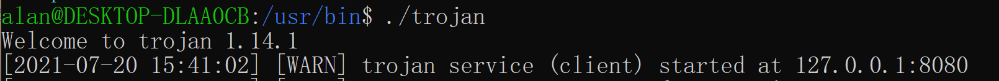
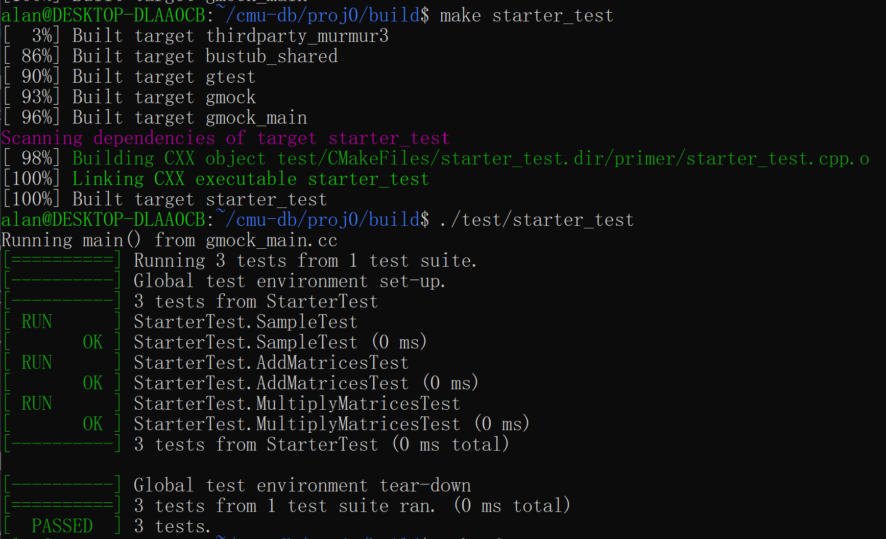
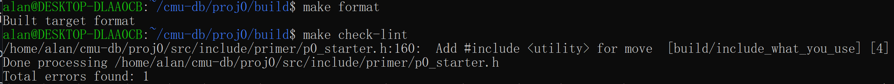
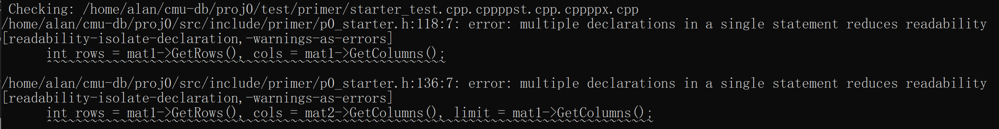
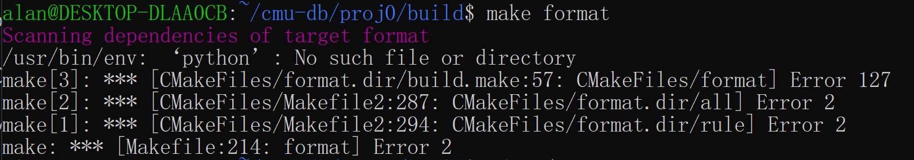

# Proj0 -- C++ Primer

## Task

modify the following code to implement matrix operations:

```c++
//===----------------------------------------------------------------------===//
//
//                         BusTub
//
// p0_starter.h
//
// Identification: src/include/primer/p0_starter.h
//
// Copyright (c) 2015-2020, Carnegie Mellon University Database Group
//
//===----------------------------------------------------------------------===//

#pragma once

#include <memory>

namespace bustub {

/*
 * The base class defining a Matrix
 */
template <typename T>
class Matrix {
 protected:
  // TODO(P0): Add implementation
  Matrix(int r, int c) {}

  // # of rows in the matrix
  int rows;
  // # of Columns in the matrix
  int cols;
  // Flattened array containing the elements of the matrix
  // TODO(P0) : Allocate the array in the constructor. Don't forget to free up
  // the array in the destructor.
  T *linear;

 public:
  // Return the # of rows in the matrix
  virtual int GetRows() = 0;

  // Return the # of columns in the matrix
  virtual int GetColumns() = 0;

  // Return the (i,j)th  matrix element
  virtual T GetElem(int i, int j) = 0;

  // Sets the (i,j)th  matrix element to val
  virtual void SetElem(int i, int j, T val) = 0;

  // Sets the matrix elements based on the array arr
  virtual void MatImport(T *arr) = 0;

  // TODO(P0): Add implementation
  virtual ~Matrix() = default;
};

template <typename T>
class RowMatrix : public Matrix<T> {
 public:
  // TODO(P0): Add implementation
  RowMatrix(int r, int c) : Matrix<T>(r, c) {}

  // TODO(P0): Add implementation
  int GetRows() override { return 0; }

  // TODO(P0): Add implementation
  int GetColumns() override { return 0; }

  // TODO(P0): Add implementation
  T GetElem(int i, int j) override { return data_[i][j]; }

  // TODO(P0): Add implementation
  void SetElem(int i, int j, T val) override {}

  // TODO(P0): Add implementation
  void MatImport(T *arr) override {}

  // TODO(P0): Add implementation
  ~RowMatrix() override = default;

 private:
  // 2D array containing the elements of the matrix in row-major format
  // TODO(P0): Allocate the array of row pointers in the constructor. Use these pointers
  // to point to corresponding elements of the 'linear' array.
  // Don't forget to free up the array in the destructor.
  T **data_;
};

template <typename T>
class RowMatrixOperations {
 public:
  // Compute (mat1 + mat2) and return the result.
  // Return nullptr if dimensions mismatch for input matrices.
  static std::unique_ptr<RowMatrix<T>> AddMatrices(std::unique_ptr<RowMatrix<T>> mat1,
                                                   std::unique_ptr<RowMatrix<T>> mat2) {
    // TODO(P0): Add code

    return std::unique_ptr<RowMatrix<T>>(nullptr);
  }

  // Compute matrix multiplication (mat1 * mat2) and return the result.
  // Return nullptr if dimensions mismatch for input matrices.
  static std::unique_ptr<RowMatrix<T>> MultiplyMatrices(std::unique_ptr<RowMatrix<T>> mat1,
                                                        std::unique_ptr<RowMatrix<T>> mat2) {
    // TODO(P0): Add code

    return std::unique_ptr<RowMatrix<T>>(nullptr);
  }

  // Simplified GEMM (general matrix multiply) operation
  // Compute (matA * matB + matC). Return nullptr if dimensions mismatch for input matrices
  static std::unique_ptr<RowMatrix<T>> GemmMatrices(std::unique_ptr<RowMatrix<T>> matA,
                                                    std::unique_ptr<RowMatrix<T>> matB,
                                                    std::unique_ptr<RowMatrix<T>> matC) {
    // TODO(P0): Add code

    return std::unique_ptr<RowMatrix<T>>(nullptr);
  }
};
}  // namespace bustub
```

## Solution

### Set up Environment

Because the project seems that it should be developed under Linux, so I develop the project under WSL.

1. Create WSL (Ubuntu-20.04)
2. In home directory, create the project folder `~/cmu-db/proj0`
3. run command `git init` to initialize the git.

According to the instructions on https://15445.courses.cs.cmu.edu/fall2020/project0/, run the following command:

```
$ git remote add public https://github.com/cmu-db/bustub.git
$ git fetch public
$ git merge public/master
$ sudo ./build_support/packages.sh
```

### Finish the Code:

```c++
//===----------------------------------------------------------------------===//
//
//                         BusTub
//
// p0_starter.h
//
// Identification: src/include/primer/p0_starter.h
//
// Copyright (c) 2015-2020, Carnegie Mellon University Database Group
//
//===----------------------------------------------------------------------===//

#pragma once

#include <memory>

namespace bustub {

/*
 * The base class defining a Matrix
 */
template <typename T>
class Matrix {
 protected:
  // TODO(P0): Add implementation
  Matrix(int r, int c) {
    rows = r;
    cols = c;
    linear = new T[r * c];
  }

  // # of rows in the matrix
  int rows;
  // # of Columns in the matrix
  int cols;
  // Flattened array containing the elements of the matrix
  // TODO(P0) : Allocate the array in the constructor. Don't forget to free up
  // the array in the destructor.
  T *linear;

 public:
  // Return the # of rows in the matrix
  virtual int GetRows() = 0;

  // Return the # of columns in the matrix
  virtual int GetColumns() = 0;

  // Return the (i,j)th  matrix element
  virtual T GetElem(int i, int j) = 0;

  // Sets the (i,j)th  matrix element to val
  virtual void SetElem(int i, int j, T val) = 0;

  // Sets the matrix elements based on the array arr
  virtual void MatImport(T *arr) = 0;

  // TODO(P0): Add implementation
  virtual ~Matrix() { delete linear; }
};

template <typename T>
class RowMatrix : public Matrix<T> {
 public:
  // TODO(P0): Add implementation
  RowMatrix(int r, int c) : Matrix<T>(r, c) {
    data_ = new T *[r];
    for (int i = 0; i < r; i++) {
      data_[i] = new T[c];
    }
  }

  // TODO(P0): Add implementation
  int GetRows() override { return this->rows; }

  // TODO(P0): Add implementation
  int GetColumns() override { return this->cols; }

  // TODO(P0): Add implementation
  T GetElem(int i, int j) override { return data_[i][j]; }

  // TODO(P0): Add implementation
  void SetElem(int i, int j, T val) override { data_[i][j] = val; }

  // TODO(P0): Add implementation
  void MatImport(T *arr) override {
    for (int i = 0; i < this->rows; i++) {
      for (int j = 0; j < this->cols; j++) {
        SetElem(i, j, arr[i * this->cols + j]);
      }
    }
  }

  // TODO(P0): Add implementation
  ~RowMatrix() override {
    for (int i = 0; i < this->rows; i++) {
      delete data_[i];
    }
    delete data_;
  }

 private:
  // 2D array containing the elements of the matrix in row-major format
  // TODO(P0): Allocate the array of row pointers in the constructor. Use these pointers
  // to point to corresponding elements of the 'linear' array.
  // Don't forget to free up the array in the destructor.
  T **data_;
};

template <typename T>
class RowMatrixOperations {
 public:
  // Compute (mat1 + mat2) and return the result.
  // Return nullptr if dimensions mismatch for input matrices.
  static std::unique_ptr<RowMatrix<T>> AddMatrices(std::unique_ptr<RowMatrix<T>> mat1,
                                                   std::unique_ptr<RowMatrix<T>> mat2) {
    // TODO(P0): Add code
    if (mat1->GetRows() == mat2->GetRows() && mat1->GetColumns() == mat2->GetColumns()) {
      int rows = mat1->GetRows(), cols = mat1->GetColumns();
      std::unique_ptr<RowMatrix<T>> res{new RowMatrix<T>(rows, cols)};
      for (int i = 0; i < rows; i++) {
        for (int j = 0; j < cols; j++) {
          res->SetElem(i, j, mat1->GetElem(i, j) + mat2->GetElem(i, j));
        }
      }
      return res;
    }
    return std::unique_ptr<RowMatrix<T>>(nullptr);
  }

  // Compute matrix multiplication (mat1 * mat2) and return the result.
  // Return nullptr if dimensions mismatch for input matrices.
  static std::unique_ptr<RowMatrix<T>> MultiplyMatrices(std::unique_ptr<RowMatrix<T>> mat1,
                                                        std::unique_ptr<RowMatrix<T>> mat2) {
    // TODO(P0): Add code
    if (mat2->GetRows() == mat1->GetColumns()) {
      int rows = mat1->GetRows(), cols = mat2->GetColumns(), limit = mat1->GetColumns();
      std::unique_ptr<RowMatrix<T>> res{new RowMatrix<T>(rows, cols)};
      for (int i = 0; i < rows; i++) {
        for (int j = 0; j < cols; j++) {
          int valij = 0;
          for (int k = 0; k < limit; k++) {
            valij += mat1->GetElem(i, k) * mat2->GetElem(k, j);
          }
          res->SetElem(i, j, valij);
        }
      }
      return res;
    }
    return std::unique_ptr<RowMatrix<T>>(nullptr);
  }

  // Simplified GEMM (general matrix multiply) operation
  // Compute (matA * matB + matC). Return nullptr if dimensions mismatch for input matrices
  static std::unique_ptr<RowMatrix<T>> GemmMatrices(std::unique_ptr<RowMatrix<T>> matA,
                                                    std::unique_ptr<RowMatrix<T>> matB,
                                                    std::unique_ptr<RowMatrix<T>> matC) {
    // TODO(P0): Add code
    std::unique_ptr<RowMatrix<T>> product_ptr = MultiplyMatrices(std::move(matA), std::move(matB));
    if (product_ptr != nullptr) {
      std::unique_ptr<RowMatrix<T>> sum_ptr = AddMatrices(std::move(product_ptr), std::move(matC));
      if (sum_ptr != nullptr) {
        return sum_ptr;
      }
    }
    return std::unique_ptr<RowMatrix<T>>(nullptr);
  }
};
}  // namespace bustub

```

### Build the System

Following the instructions on the course website, run the following command to build the system:

```
$ mkdir build
$ cd build
$ cmake ..
$ make -j 4
```

#### Problems Encountered

##### 1. The Network Problem

When running the command `cmake ..` , it failed to `git clone googletest`because the traffic towards foreign servers is extremely slow and unstable in China. Therefore, network proxy is needed. 

To solve it, run `sudo apt install trojan` to install [the opensource proxy software](https://github.com/trojan-gfw/trojan), and edit `/etc/trojan/config.json` to config it as `client`(I had previously set up a server in NY, the US). After that, open another WSL window and run `/usr/bin/trojan`:



Besides, to make commands to go through proxy, another tool named [proxychains](https://github.com/haad/proxychains).Config it by running `vim /etc/proxychains.conf` and append `socks5  127.0.0.1 8080` at the end of the file.

Finally, run `proxychains cmake ..` instead of `cmake ..`, and it run successfully. 

##### 2. The Problem of `make`

When run the command `make`, it prompted something like 

```
cc1plus: error: bad value (‘tigerlake’) for ‘-march=’ switch

cc1plus: note: valid arguments to ‘-march=’ switch are: nocona core2 nehalem corei7 westmere sandybridge corei7-avx ivybridge core-avx-i haswell core-avx2 broadwell skylake skylake-avx512 cannonlake icelake-client icelake-server cascadelake bonnell atom silvermont slm goldmont goldmont-plus tremont knl knm x86-64 eden-x2 nano nano-1000 nano-2000 nano-3000 nano-x2 eden-x4 nano-x4 k8 k8-sse3 opteron opteron-sse3 athlon64 athlon64-sse3 athlon-fx amdfam10 barcelona bdver1 bdver2 bdver3 bdver4 znver1 znver2 btver1 btver2 native
```

According to the [forum](https://stackoverflow.com/questions/64493692/cc1plus-error-bad-value-tigerlake-for-march-switch-compilation-error), the problem is caused by old compilers and can be fixed by following steps:

```
sudo proxychains apt install g++-10
sudo update-alternatives --install /usr/bin/gcc gcc /usr/bin/gcc-10 100 --slave /usr/bin/g++ g++ /usr/bin/g++-10 --slave /usr/bin/gcov gcov /usr/bin/gcov-10
```

### Run the Test



### Format check

#### Results:





#### Problem Encountered



According to the [forum](sudo ln -s /usr/bin/python3 /usr/bin/python), the problem can be fixed by:

```
sudo ln -s /usr/bin/python3 /usr/bin/python
```

## Adjustment

According to the results of format check, rewrite the source code as follows:

```c++
//===----------------------------------------------------------------------===//
//
//                         BusTub
//
// p0_starter.h
//
// Identification: src/include/primer/p0_starter.h
//
// Copyright (c) 2015-2020, Carnegie Mellon University Database Group
//
//===----------------------------------------------------------------------===//

#pragma once

#include <memory>

namespace bustub {

/*
 * The base class defining a Matrix
 */
template <typename T>
class Matrix {
 protected:
  // TODO(P0): Add implementation
  Matrix(int r, int c) {
    rows = r;
    cols = c;
    linear = new T[r * c];
  }

  // # of rows in the matrix
  int rows;
  // # of Columns in the matrix
  int cols;
  // Flattened array containing the elements of the matrix
  // TODO(P0) : Allocate the array in the constructor. Don't forget to free up
  // the array in the destructor.
  T *linear;

 public:
  // Return the # of rows in the matrix
  virtual int GetRows() = 0;

  // Return the # of columns in the matrix
  virtual int GetColumns() = 0;

  // Return the (i,j)th  matrix element
  virtual T GetElem(int i, int j) = 0;

  // Sets the (i,j)th  matrix element to val
  virtual void SetElem(int i, int j, T val) = 0;

  // Sets the matrix elements based on the array arr
  virtual void MatImport(T *arr) = 0;

  // TODO(P0): Add implementation
  virtual ~Matrix() { delete linear; }
};

template <typename T>
class RowMatrix : public Matrix<T> {
 public:
  // TODO(P0): Add implementation
  RowMatrix(int r, int c) : Matrix<T>(r, c) {
    data_ = new T *[r];
    for (int i = 0; i < r; i++) {
      data_[i] = new T[c];
    }
  }

  // TODO(P0): Add implementation
  int GetRows() override { return this->rows; }

  // TODO(P0): Add implementation
  int GetColumns() override { return this->cols; }

  // TODO(P0): Add implementation
  T GetElem(int i, int j) override { return data_[i][j]; }

  // TODO(P0): Add implementation
  void SetElem(int i, int j, T val) override { data_[i][j] = val; }

  // TODO(P0): Add implementation
  void MatImport(T *arr) override {
    for (int i = 0; i < this->rows; i++) {
      for (int j = 0; j < this->cols; j++) {
        SetElem(i, j, arr[i * this->cols + j]);
      }
    }
  }

  // TODO(P0): Add implementation
  ~RowMatrix() override {
    for (int i = 0; i < this->rows; i++) {
      delete data_[i];
    }
    delete data_;
  }

 private:
  // 2D array containing the elements of the matrix in row-major format
  // TODO(P0): Allocate the array of row pointers in the constructor. Use these pointers
  // to point to corresponding elements of the 'linear' array.
  // Don't forget to free up the array in the destructor.
  T **data_;
};

template <typename T>
class RowMatrixOperations {
 public:
  // Compute (mat1 + mat2) and return the result.
  // Return nullptr if dimensions mismatch for input matrices.
  static std::unique_ptr<RowMatrix<T>> AddMatrices(std::unique_ptr<RowMatrix<T>> mat1,
                                                   std::unique_ptr<RowMatrix<T>> mat2) {
    // TODO(P0): Add code
    if (mat1->GetRows() == mat2->GetRows() && mat1->GetColumns() == mat2->GetColumns()) {
      int rows = mat1->GetRows();
      int cols = mat1->GetColumns();
      std::unique_ptr<RowMatrix<T>> res{new RowMatrix<T>(rows, cols)};
      for (int i = 0; i < rows; i++) {
        for (int j = 0; j < cols; j++) {
          res->SetElem(i, j, mat1->GetElem(i, j) + mat2->GetElem(i, j));
        }
      }
      return res;
    }
    return std::unique_ptr<RowMatrix<T>>(nullptr);
  }

  // Compute matrix multiplication (mat1 * mat2) and return the result.
  // Return nullptr if dimensions mismatch for input matrices.
  static std::unique_ptr<RowMatrix<T>> MultiplyMatrices(std::unique_ptr<RowMatrix<T>> mat1,
                                                        std::unique_ptr<RowMatrix<T>> mat2) {
    // TODO(P0): Add code
    if (mat2->GetRows() == mat1->GetColumns()) {
      int rows = mat1->GetRows();
      int cols = mat2->GetColumns();
      int limit = mat1->GetColumns();
      std::unique_ptr<RowMatrix<T>> res{new RowMatrix<T>(rows, cols)};
      for (int i = 0; i < rows; i++) {
        for (int j = 0; j < cols; j++) {
          int valij = 0;
          for (int k = 0; k < limit; k++) {
            valij += mat1->GetElem(i, k) * mat2->GetElem(k, j);
          }
          res->SetElem(i, j, valij);
        }
      }
      return res;
    }
    return std::unique_ptr<RowMatrix<T>>(nullptr);
  }

  // Simplified GEMM (general matrix multiply) operation
  // Compute (matA * matB + matC). Return nullptr if dimensions mismatch for input matrices
  static std::unique_ptr<RowMatrix<T>> GemmMatrices(std::unique_ptr<RowMatrix<T>> matA,
                                                    std::unique_ptr<RowMatrix<T>> matB,
                                                    std::unique_ptr<RowMatrix<T>> matC) {
    // TODO(P0): Add code
    std::unique_ptr<RowMatrix<T>> product_ptr = MultiplyMatrices(std::move(matA), std::move(matB));
    if (product_ptr != nullptr) {
      std::unique_ptr<RowMatrix<T>> sum_ptr = AddMatrices(std::move(product_ptr), std::move(matC));
      if (sum_ptr != nullptr) {
        return sum_ptr;
      }
    }
    return std::unique_ptr<RowMatrix<T>>(nullptr);
  }
};
}  // namespace bustub

```


