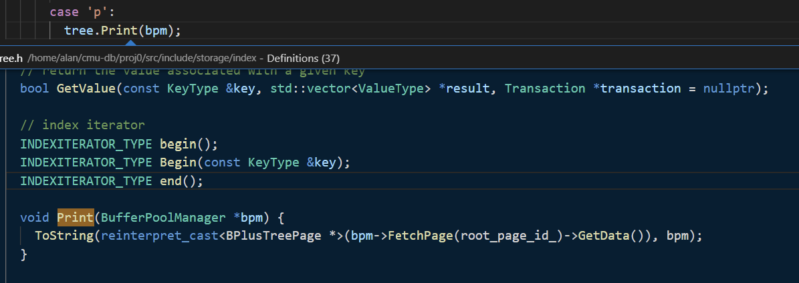
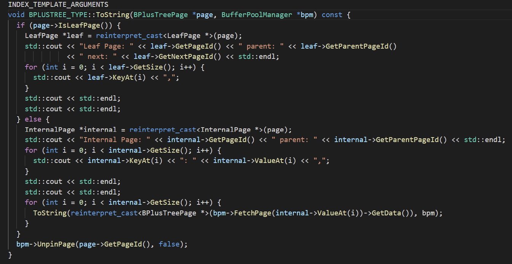
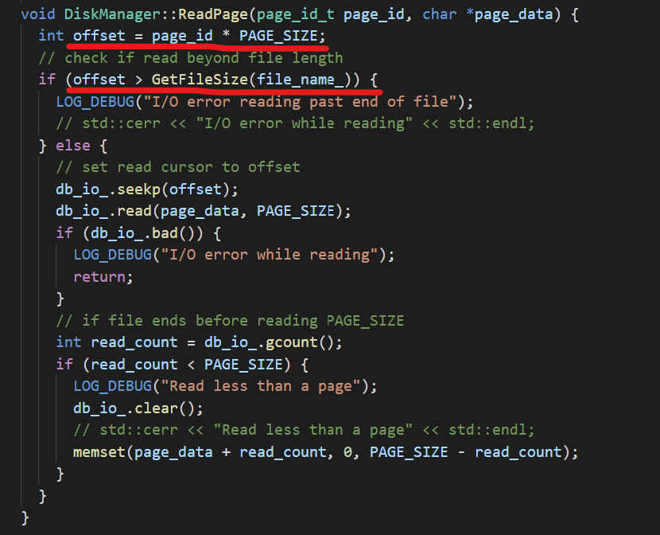

# Some Potential Problems

### Problem Appeared In Print Test

In `B_plus_tree_print_test`, the buffer pool size is only 100. Therefore, if I insert large amount of keys into a b+ tree with a small degree, it may cause buffer pool manager work improperly and output weird results. 

For example, I set the max size of both leaf node and internal node to 3, then insert 200 randomly generated keys into it. As a result, it will create 103 pages, which exceeds the capacity of buffer pool: (Below is the last few records in a running log)

```
2021-08-26 14:57:38 [home/alan/cmu-db/proj0/src/storage/index/b_plus_tree.cpp:77:Insert] INFO  - Insert 31
2021-08-26 14:57:38 [home/alan/cmu-db/proj0/src/storage/page/b_plus_tree_leaf_page.cpp:38:Init] INFO  - Create a leaf page, page_id: 103, is leaf: 1, max_size: 3, size: 0
2021-08-26 14:57:38 [home/alan/cmu-db/proj0/src/storage/index/b_plus_tree.cpp:77:Insert] INFO  - Insert 96
2021-08-26 14:57:38 [home/alan/cmu-db/proj0/src/storage/index/b_plus_tree.cpp:88:Insert] WARN  - Insert duplicate key -> 96 !!!
2021-08-26 14:57:38 [home/alan/cmu-db/proj0/src/storage/index/b_plus_tree.cpp:77:Insert] INFO  - Insert 96
2021-08-26 14:57:38 [home/alan/cmu-db/proj0/src/storage/index/b_plus_tree.cpp:88:Insert] WARN  - Insert duplicate key -> 96 !!!
```

Once the tree is finished with insertion, when I want to print it, there will be some warning like this:

```
> p
Internal Page: 90 parent: -1
0: 37,122: 89,

Internal Page: 37 parent: 90
0: 15,71: 58,

Internal Page: 15 parent: 37
0: 7,29: 61,49: 40,

Internal Page: 7 parent: 15
0: 3,16: 99,22: 48,

Internal Page: 3 parent: 7
0: 1,9: 47,12: 100,

Internal Page: 0 parent: 0


Leaf Page: 47 parent: 3 next: 100
9,11,

2021-08-26 15:01:04 [home/alan/cmu-db/proj0/src/storage/disk/disk_manager.cpp:104:ReadPage] DEBUG - I/O error reading past end of file
Internal Page: 0 parent: 0
```

Inspect how the print functions:







It is clear that the `page_id` is too big that exceeds the file size. Therefore, the erroneous result should not be considered as a bug. 

In conclusion, my implementation of b+tree still successfully handled insertion and deletion.  

### Problem About Memory Leak

When I ran the command

```
make b_plus_tree_insert_test
valgrind --trace-children=yes \
   --leak-check=full \
   --track-origins=yes \
   --soname-synonyms=somalloc=*jemalloc* \
   --error-exitcode=1 \
   --suppressions=../build_support/valgrind.supp \
   ./test/b_plus_tree_insert_test
```

to check memory leak, it output the following result, which showed that I have a memory leak:

```
alan@DESKTOP-DLAA0CB:~/cmu-db/proj0/build$ valgrind --trace-children=yes    --leak-check=full    --track-origins=yes    --soname-synonyms=somalloc=*jemalloc*    --error-exitcode=1    --suppressions=../build_support/valgrind.supp   --show-leak-kinds=all   ./test/lru_replacer_test
==3949== Memcheck, a memory error detector
==3949== Copyright (C) 2002-2017, and GNU GPL'd, by Julian Seward et al.
==3949== Using Valgrind-3.15.0 and LibVEX; rerun with -h for copyright info
==3949== Command: ./test/lru_replacer_test
==3949==
Running main() from gmock_main.cc
[==========] Running 1 test from 1 test suite.
[----------] Global test environment set-up.
[----------] 1 test from LRUReplacerTest
[ RUN      ] LRUReplacerTest.SampleTest
[       OK ] LRUReplacerTest.SampleTest (12 ms)
[----------] 1 test from LRUReplacerTest (19 ms total)

[----------] Global test environment tear-down
[==========] 1 test from 1 test suite ran. (63 ms total)
[  PASSED  ] 1 test.
==3949==
==3949== HEAP SUMMARY:
==3949==     in use at exit: 128 bytes in 8 blocks
==3949==   total heap usage: 191 allocs, 183 frees, 115,250 bytes allocated
==3949==
==3949== 16 bytes in 1 blocks are still reachable in loss record 1 of 8
==3949==    at 0x483BC83: operator new(unsigned long) (in /usr/lib/x86_64-linux-gnu/valgrind/vgpreload_memcheck-amd64-linux.so)
==3949==    by 0x49712F0: __static_initialization_and_destruction_0(int, int) (in /home/alan/cmu-db/proj0/build/lib/libbustub_shared.so)
==3949==    by 0x49714F2: _GLOBAL__sub_I_type.cpp (in /home/alan/cmu-db/proj0/build/lib/libbustub_shared.so)
==3949==    by 0x4011B89: call_init.part.0 (dl-init.c:72)
==3949==    by 0x4011C90: call_init (dl-init.c:30)
==3949==    by 0x4011C90: _dl_init (dl-init.c:119)
==3949==    by 0x4001139: ??? (in /usr/lib/x86_64-linux-gnu/ld-2.31.so)
...
```

However, I double checked my code and did not find any potential leak. Thus, I assume that it may appear in buffer pool manager. After check, I found that it was actually `lru_replacer` that have memory leak. To determine which part caused the leak, I comment out all the private members in `lru_replacer` and emptied the functions:

```c++
class LRUReplacer : public Replacer {
 public:
  /**
   * Create a new LRUReplacer.
   * @param num_pages the maximum number of pages the LRUReplacer will be required to store
   */
  explicit LRUReplacer(size_t num_pages);

  /**
   * Destroys the LRUReplacer.
   */
  ~LRUReplacer() override;

  bool Victim(frame_id_t *frame_id) override { return false; }

  void Pin(frame_id_t frame_id) override { ; }

  void Unpin(frame_id_t frame_id) override { ; }

  size_t Size() override { 
    return 0;
  }

 private:
  // TODO(student): implement me!
  //size_t capacity;
  //std::list<frame_id_t> table;
  //std::mutex thread_lock;
  /*
    int find(frame_id_t frame_id) {
      int i = 0;
      for (auto it = table.begin(); it != table.end(); it++, i++) {
        if (*it == frame_id) {
          return i;
        }
      }
      return -1;
    }*/
};
```

 But memory leak still occurred the same as before.

Since it did not provide useful information for debugging, I came out with another idea: deliberately make a memory leak and observe what would happen. Therefore, I added a private member `char *test` in `lru_replacer.h`, and initialized it in constructor in `lru_replacer.cpp` : `test = new char[10]` without delete it in destructor, then I ran the memory check again:

```
alan@DESKTOP-DLAA0CB:~/cmu-db/proj0/build$ valgrind --trace-children=yes    --leak-check=full    --track-origins=yes    --soname-synonyms=somalloc=*jemalloc*    --error-exitcode=1    --suppressions=../build_support/valgrind.supp   --show-leak-kinds=all   ./test/lru_replacer_test
==4323== Memcheck, a memory error detector
==4323== Copyright (C) 2002-2017, and GNU GPL'd, by Julian Seward et al.
==4323== Using Valgrind-3.15.0 and LibVEX; rerun with -h for copyright info
==4323== Command: ./test/lru_replacer_test
==4323==
Running main() from gmock_main.cc
[==========] Running 1 test from 1 test suite.
[----------] Global test environment set-up.
[----------] 1 test from LRUReplacerTest
[ RUN      ] LRUReplacerTest.SampleTest
[       OK ] LRUReplacerTest.SampleTest (10 ms)
[----------] 1 test from LRUReplacerTest (15 ms total)

[----------] Global test environment tear-down
[==========] 1 test from 1 test suite ran. (50 ms total)
[  PASSED  ] 1 test.
==4323==
==4323== HEAP SUMMARY:
==4323==     in use at exit: 138 bytes in 9 blocks
==4323==   total heap usage: 192 allocs, 183 frees, 115,260 bytes allocated
==4323==
==4323== 10 bytes in 1 blocks are definitely lost in loss record 1 of 9
==4323==    at 0x483C3A3: operator new[](unsigned long) (in /usr/lib/x86_64-linux-gnu/valgrind/vgpreload_memcheck-amd64-linux.so)
==4323==    by 0x4902086: bustub::LRUReplacer::LRUReplacer(unsigned long) (in /home/alan/cmu-db/proj0/build/lib/libbustub_shared.so)
==4323==    by 0x10B5D9: bustub::LRUReplacerTest_SampleTest_Test::TestBody() (in /home/alan/cmu-db/proj0/build/test/lru_replacer_test)
==4323==    by 0x4A8A1CE: void testing::internal::HandleSehExceptionsInMethodIfSupported<testing::Test, void>(testing::Test*, void (testing::Test::*)(), char const*) (in /home/alan/cmu-db/proj0/build/lib/libgtest.so.1.11.0)
==4323==    by 0x4A81F66: void testing::internal::HandleExceptionsInMethodIfSupported<testing::Test, void>(testing::Test*, void (testing::Test::*)(), char const*) (in /home/alan/cmu-db/proj0/build/lib/libgtest.so.1.11.0)
==4323==    by 0x4A54F6D: testing::Test::Run() (in /home/alan/cmu-db/proj0/build/lib/libgtest.so.1.11.0)
==4323==    by 0x4A559AF: testing::TestInfo::Run() (in /home/alan/cmu-db/proj0/build/lib/libgtest.so.1.11.0)
==4323==    by 0x4A562C3: testing::TestSuite::Run() (in /home/alan/cmu-db/proj0/build/lib/libgtest.so.1.11.0)
==4323==    by 0x4A65E00: testing::internal::UnitTestImpl::RunAllTests() (in /home/alan/cmu-db/proj0/build/lib/libgtest.so.1.11.0)
==4323==    by 0x4A8B255: bool testing::internal::HandleSehExceptionsInMethodIfSupported<testing::internal::UnitTestImpl, bool>(testing::internal::UnitTestImpl*, bool (testing::internal::UnitTestImpl::*)(), char const*) (in /home/alan/cmu-db/proj0/build/lib/libgtest.so.1.11.0)
==4323==    by 0x4A831B8: bool testing::internal::HandleExceptionsInMethodIfSupported<testing::internal::UnitTestImpl, bool>(testing::internal::UnitTestImpl*, bool (testing::internal::UnitTestImpl::*)(), char const*) (in /home/alan/cmu-db/proj0/build/lib/libgtest.so.1.11.0)
==4323==    by 0x4A644E6: testing::UnitTest::Run() (in /home/alan/cmu-db/proj0/build/lib/libgtest.so.1.11.0)
==4323==
==4323== 16 bytes in 1 blocks are still reachable in loss record 2 of 9
==4323==    at 0x483BC83: operator new(unsigned long) (in /usr/lib/x86_64-linux-gnu/valgrind/vgpreload_memcheck-amd64-linux.so)
==4323==    by 0x4971332: __static_initialization_and_destruction_0(int, int) (in /home/alan/cmu-db/proj0/build/lib/libbustub_shared.so)
==4323==    by 0x4971534: _GLOBAL__sub_I_type.cpp (in /home/alan/cmu-db/proj0/build/lib/libbustub_shared.so)
==4323==    by 0x4011B89: call_init.part.0 (dl-init.c:72)
==4323==    by 0x4011C90: call_init (dl-init.c:30)
==4323==    by 0x4011C90: _dl_init (dl-init.c:119)
==4323==    by 0x4001139: ??? (in /usr/lib/x86_64-linux-gnu/ld-2.31.so)
...
```

According to the output, it can be inferred that if my program had a memory leak, `valgrind` will point it out in the specific class where leak happened. Leaking warnings like

```
==3949== 16 bytes in 1 blocks are still reachable in loss record 1 of 8
==3949==    at 0x483BC83: operator new(unsigned long) (in /usr/lib/x86_64-linux-gnu/valgrind/vgpreload_memcheck-amd64-linux.so)
==3949==    by 0x49712F0: __static_initialization_and_destruction_0(int, int) (in /home/alan/cmu-db/proj0/build/lib/libbustub_shared.so)
==3949==    by 0x49714F2: _GLOBAL__sub_I_type.cpp (in /home/alan/cmu-db/proj0/build/lib/libbustub_shared.so)
==3949==    by 0x4011B89: call_init.part.0 (dl-init.c:72)
==3949==    by 0x4011C90: call_init (dl-init.c:30)
==3949==    by 0x4011C90: _dl_init (dl-init.c:119)
==3949==    by 0x4001139: ??? (in /usr/lib/x86_64-linux-gnu/ld-2.31.so)
```

only indicate that the leak happens in libraries or building tools, which is not my fault.


# Feedback When I finished the project

My initial design of the tree had some flaws.

To get the end of the tree, I designed an end signal, which consists of a key = -1 and a dummy value. I want to maintain a structure that the end signal is always put at the end of leaf page. The design has a fatal error if leaf page is full, because there will be no space for me to put the end signal.  And if I do so, it will cause undefined behavior and stain the memory. The problem took me really long time to figure it out.

Besides, every time when it is inserted a pair, I have to update the end signal's position, which is tricky because I have to consider many situations like coalesce and redistribute. 

Finally I come up with the idea that I can check whether the current index iterator is pointing to the end of index, and if so, I can construct a end signal and return it. Therefore, 

