# Q2_LONG_NAME

### Requirements:

List works with longest name of each type.

**Details:** For each work type, find works that have the longest names. There might be cases where there is a tie for the longest names - in that case, return all of them. Display work names and corresponding type names, and order it according to work type (ascending) and use work name (ascending) as tie-breaker.

### My Solution:

```sqlite
SELECT w1.name, work_type.name FROM 
    work AS w1 INNER JOIN (
        SELECT MAX(length(w2.name)) AS max_len, w2.type 
        FROM work AS w2 GROUP BY w2.type
    ) AS w3 ON w1.type = w3.type AND length(w1.name) = w3.max_len
    INNER JOIN work_type ON work_type.id = w3.type
    order by w1.type asc,
    w1.name asc;
```

### My Result:

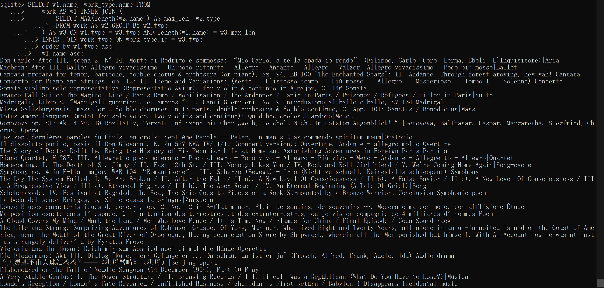

### Solution Result:


# Q3_OLD_MUSIC_NATIONS

### Requirements:

List top 10 countries with the most classical music artists (born or started before 1850) along with the number of associated artists.

**Details:** Print country and number of associated artists before 1850. For example, `Russia|191`. Sort by number of artists in descending order.

### My Solution:

```sqlite
SELECT area.name, COUNT(*) AS cnt FROM 
artist INNER JOIN area ON area.id = artist.area
WHERE artist.begin_date_year < 1850 
GROUP BY artist.area ORDER BY cnt DESC
LIMIT 10;
```

### My Result:

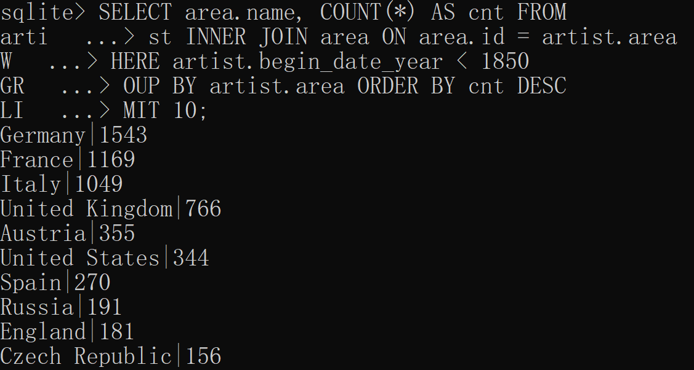

### Solution Result:

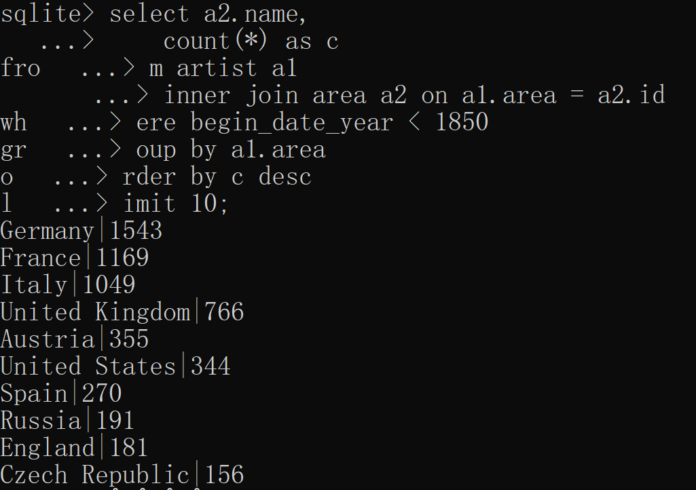


# Q4_DUBBED_SMASH

### Requirements:

List the top 10 dubbed artist names with the number of dubs.

**Details:** Count the number of distinct names in `artist_alias` for each artist in the `artist` table, and list only the top ten who's from the United Kingdom and started after 1950 (not included). Print the artist name in the `artist` table and the number of corresponding distinct dubbed artist names in the `artist_alias` table.

### My Solution:

```sqlite
SELECT artist.name, COUNT(distinct artist_alias.name) AS cnt FROM(
    artist INNER JOIN artist_alias
    ON  begin_date_year > 1950 and artist.id = artist_alias.artist
) WHERE artist.area = 221 
GROUP BY artist.id ORDER BY cnt DESC
LIMIT 10;
```

### My Results:

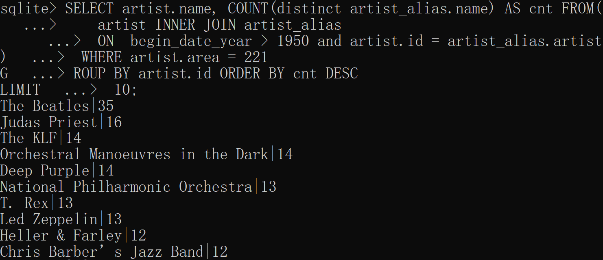

### Solution Results:

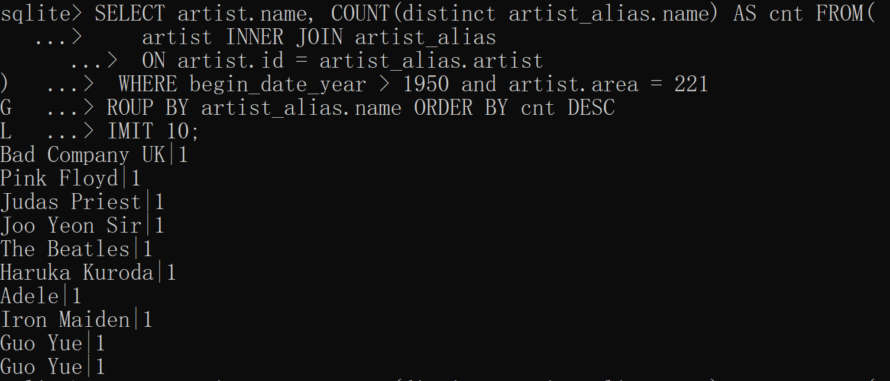

### Note

I think the solution is not correct, or I may misunderstand the requirement because I do not know much about music industry.

My understanding of this question is:

An artist may have different alias, which is described in `artist_alias` table. The question want me to find top 10 artists who's from the UK and started after 1950 according to the number of their aliases. 

# Q5_VINYL_LOVER

### Requirements:

List the distinct names of releases issued in vinyl format by the British band Coldplay.

**Details:** Vinyl format includes ALL vinyl dimensions excluding `VinylDisc`. Sort the release names by release date ascendingly.

### My Solution:

```sqlite
SELECT DISTINCT release.name FROM 
    artist_credit_name INNER JOIN artist_credit 
    ON artist_credit_name.artist_credit = artist_credit.id
    INNER JOIN release ON release.artist_credit = artist_credit.id
    INNER JOIN release_info ON release.id = release_info.release
    INNER JOIN medium ON medium.release = release.id
    INNER JOIN medium_format ON medium.format = medium_format.id
WHERE artist_credit_name.name = 'Coldplay' 
and medium_format.name like '%Vinyl'
ORDER BY release_info.date_year ASC, release_info.date_month ASC, 
         release_info.date_day ASC;
```

### My Results:

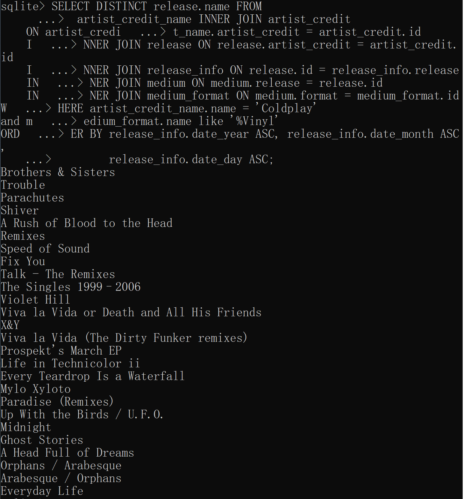

### Solution Results:

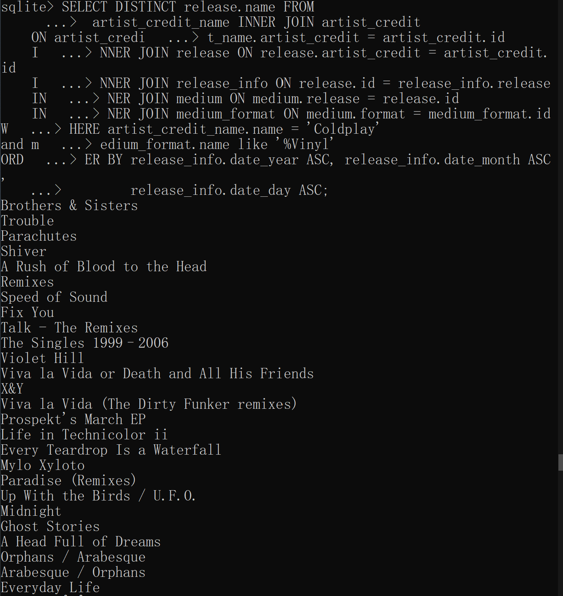

# Q6_OLD_IS_NOT_GOLD

### Requirements:

Which decades saw the most number of official releases? List the number of official releases in every decade since 1900. Like `1970s|57210`.

**Details:** Print all decades and the number of official releases. Releases with different issue dates or countries are considered different releases. Print the relevant decade in a fancier format by constructing a string that looks like this: `1970s`. Sort the decades in decreasing order with respect to the number of official releases and use decade (descending) as tie-breaker. Remember to exclude releases whose dates are `NULL`.

### My Solution:

```sqlite
SELECT rinfo.decade, COUNT(*) AS cnt FROM 
release INNER JOIN (
    SELECT (release_info.date_year / 10 * 10) || 's' AS decade,
    release_info.release FROM release_info 
    WHERE release_info.date_year >= 1900
) AS rinfo
ON rinfo.release = release.id
WHERE release.status  = 1
GROUP BY rinfo.decade
ORDER BY cnt DESC, rinfo.decade DESC;
```

### My Results:

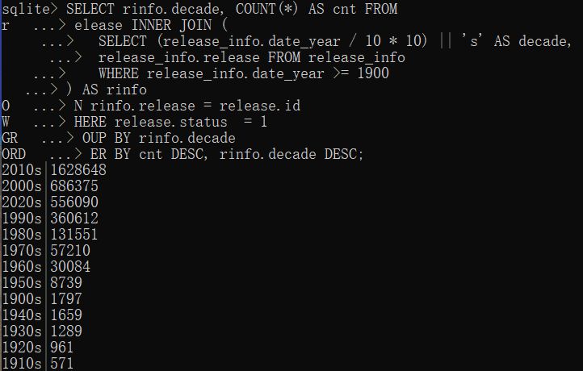

### Solution Results:

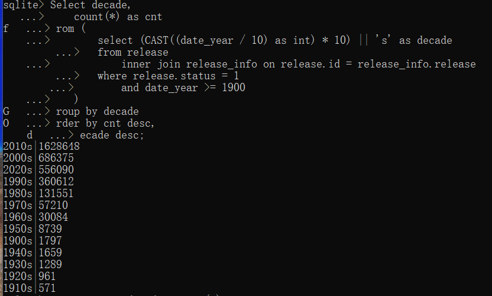

# Q7_RELEASE_PERCENTAGE

### Requirements:

List the month and the percentage of all releases issued in the corresponding month all over the world in the past year. Display like `2020.01|5.95`.

**Details:** The percentage of releases for a month is the number of releases issued in that month divided by the total releases in the past year from 07/2019 to 07/2020, both included. Releases with different issue dates or countries are considered different releases. Round the percentage to two decimal places using `ROUND()`. Sort by dates in ascending order.

### My Solution:

```sqlite
SELECT 
    (date_year||'.'||(
           case 
               when date_month < 10 THEN '0'
               else ''
           end
       ) ||date_month) AS dates,
    (ROUND(COUNT(*)*100.0/
    (
    SELECT COUNT(*) FROM release_info
       WHERE (date_year = 2019 AND date_month >= 7)
       OR (date_year = 2020 AND date_month <= 7)
    ), 2)
       ) AS percentage
FROM release_info
WHERE (date_year = 2019 AND date_month >= 7) OR (date_year = 2020 AND date_month <= 7)
GROUP BY date_year, date_month
ORDER BY dates ASC;
```

### My Results:

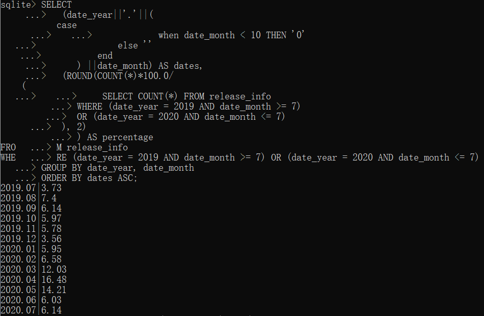

### Solution Results:

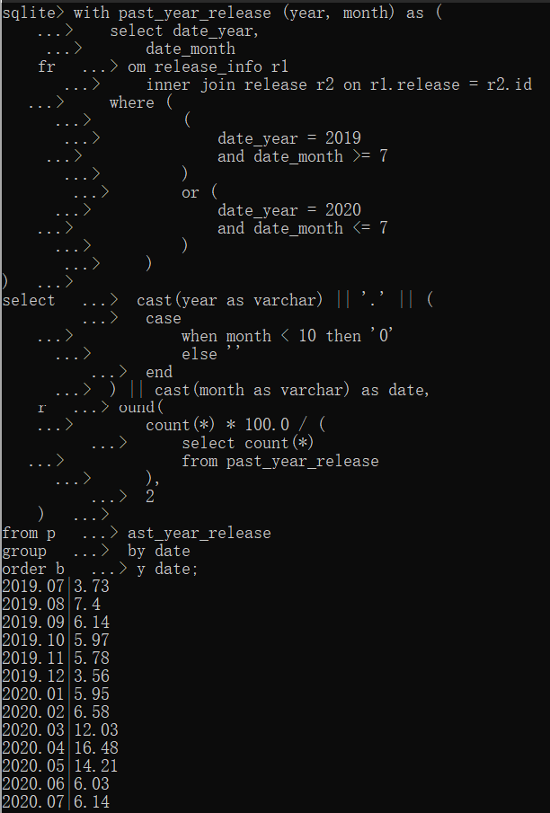

# Q8_COLLABORATE_ARTIST

### Requirements:

List the number of artists who have collaborated with Ariana Grande.

**Details:** Print only the total number of artists. An artist is considered a collaborator if they appear in the same artist_credit with Ariana Grande. The answer should include Ariana Grande herself.

### My Solution:

```sqlite
WITH newtable AS
(SELECT artist_credit FROM artist_credit_name WHERE name = 'Ariana Grande')
SELECT COUNT(DISTINCT artist) FROM artist_credit_name
WHERE artist_credit IN newtable;
```

# Q9_DRE_AND_EMINEM

### Requirements:

List the rank, artist names, along with the number of collaborative releases of Dr. Dre and Eminem among other most productive duos (as long as they appear in the same release) both started after 1960 (not included). Display like `[rank]|Dr. Dre|Eminem|[# of releases]`.

**Details:** For example, if you see a release by A, B, and C, it will contribute to three pairs of duos: `A|B|1`, `A|C|1`, and `B|C|1`. You will first need to calculate a rank of these duos by number of collaborated releases (release with artist_credit shared by both artists) sorted descendingly, and then find the rank of `Dr. Dre` and `Eminem`. Only releases in English are considered. Both artists should be solo artists. All pairs of names should have the alphabetically smaller one first. Use artist names (asc) as tie breaker.

**Hint:** Artist aliases may be used everywhere. When doing aggregation, using artist ids will ensure you get the correct results. One example entry in the rank list is `9|Benj Pasek|Justin Paul|27`

### My Solution:

```sqlite
```


### My Results:

### Solution Results:

# Q10_AROUND_THE_WORLD

### Requirements:

Concat all dubbed names of The Beatles using comma-separated values(like "`Beetles, fab four`").

**Details:** Find all dubbed names of artist "`The Beatles`" in artist_alias and order them by id (ascending). Print a single string containing all the dubbed names separated by commas.

**Hint:** You might find [CTEs](https://sqlite.org/lang_with.html) useful.

### My Solution:

```sqlite
WITH newtable(nm, rownum) as(
    SELECT artist_alias.name, row_number() over(ORDER BY artist_alias.id ASC)
    FROM artist_alias INNER JOIN artist ON artist.id = artist_alias.artist
    WHERE artist.name = 'The Beatles' 
),
rec(name, num) as (
    SELECT * FROM newtable WHERE rownum = 1
    UNION 
        SELECT rec.name || ', ' || newtable.nm, num+1
        FROM rec INNER JOIN newtable ON newtable.rownum = rec.num+1
)
SELECT rec.name FROM rec ORDER BY rec.name DESC LIMIT 1;
```


### My Results:

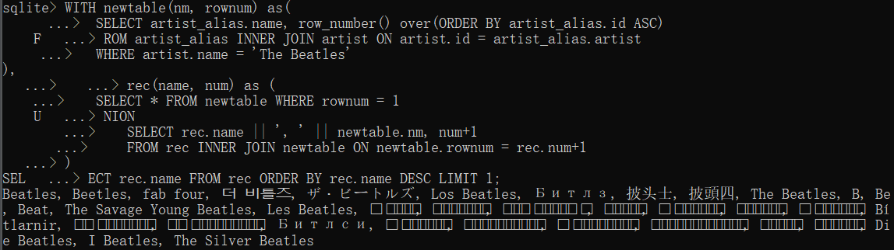

### Solution Results:

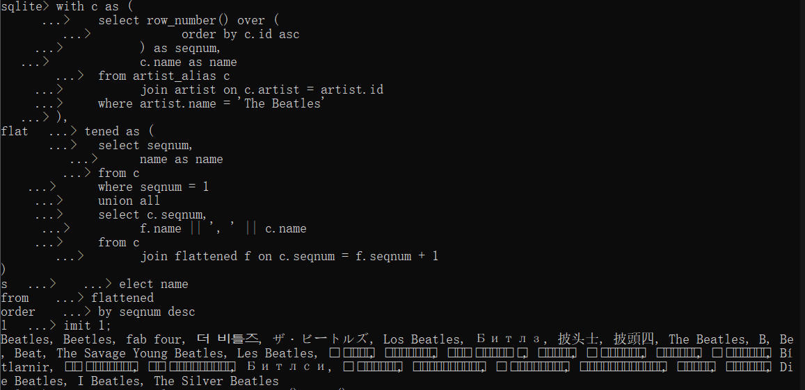
